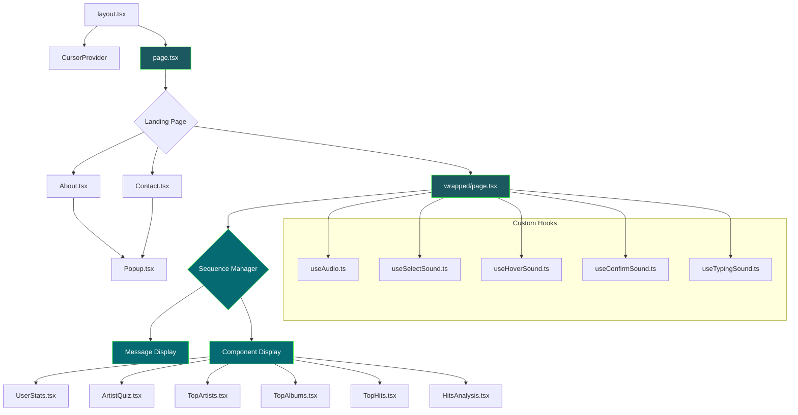
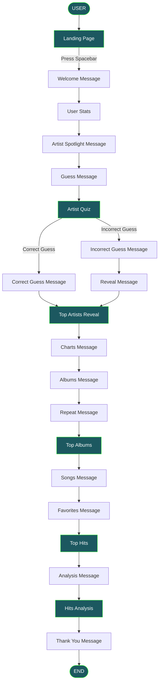

# Spotify Wrapped 2024 (90s Edition) 🎧


> Una aplicación web interactiva que reinventa el Spotify Wrapped a través de la estética de los 90s y gráficos de 8 bits.

---

## 📋 Tabla de Contenidos

- [Descripción general](#-descripción-general)
- [Stack Tecnológico](#️-stack-tecnológico)
- [Funcionalidades Principales](#-funcionalidades-principales)
- [Componentes de UI Interactivos](#️-componentes-de-ui-interactivos)
- [Arquitectura](#️-arquitectura)
- [Flujo de Usuario](#-flujo-de-usuario)
- [Primeros Pasos](#-primeros-pasos)
  - [Requisitos Previos](#-requisitos-previos)
  - [Estructura del Proyecto](#-estructura-del-proyecto)

---

## 📜 Descripción general
Lo que comenzó como un resumen experimental de fin de año en 2016, Spotify Wrapped evolucionó rápidamente hasta convertirse en una tradición global, invitando a usuarios de todo el mundo a descubrir su narrativa musical y celebrar en conjunto los sonidos que definieron el año.

Este proyecto es una reinvención creativa del Spotify Wrapped, inspirada en la estética de los 90s y los gráficos de 8 bits. También funciona como una demostración técnica de cómo las tecnologías modernas de desarrollo web pueden crear experiencias inmersivas y narrativas, sin dejar de lado elementos nostálgicos y retro.

## 🛠️ Stack Tecnológico
- **Framework Frontend**: Next.js 15.1.0 con React 18.2.0
- **Estilos**: TailwindCSS 3.4.1 con animaciones y efectos CSS personalizados
- **Fuentes**: Google Fonts (Pixelify Sans) para la estética retro de texto en píxeles
- **Visualización de Datos**: Recharts 2.15.0 para gráficos y visualizaciones interactivas
- **Manejo de Estado**: Hooks useState y useEffect de React a nivel de componente
- **Enrutamiento**: Next.js App Router con navegación del lado del cliente
- **Animación**: Transiciones CSS personalizadas y animaciones con keyframes
- **Diseño Responsive**: Clases responsive de TailwindCSS con manejo personalizado del viewport
- **Tipado**: TypeScript para verificación de tipos y mejor experiencia de desarrollo


## 🎵 Funcionalidades Principales

<table> <tr> <td align="center"> <h3>🎮 Quiz Interactivo de Artistas</h3> <p>Adivina tu artista principal entre varias opciones, con retroalimentación interactiva</p> </td> <td align="center"> <h3>📊 Análisis de Gustos Musicales</h3> <p>Visualización interactiva en gráfico circular de tus preferencias musicales</p> </td> </tr> <tr> <td align="center"> <h3>💿 Revelación de Álbumes Top</h3> <p>Revelación interactiva de los álbumes principales con transiciones animadas</p> </td> <td align="center"> <h3>⌨️ Mensajes con Efecto de Máquina de Escribir</h3> <p>Efecto animado de máquina de escribir para los mensajes, con cursor retro</p> </td> </tr> </table>

## 🎛️ Componentes de UI Interactivos

<table> <tr> <th colspan="2" align="center">Resumen de los Componentes Clave</th> </tr> <tr valign="top"> <td width="50%">

### ArtistQuiz.tsx

Quiz interactivo donde el usuario adivina cuál fue su artista principal del año

**Características Clave:**

- Selección de artista por opción múltiple
- Botones interactivos con efectos al pasar el cursor (hover)
- Ícono de misterio que oculta la respuesta
- Avance con la barra espaciadora tras seleccionar

**Lógica del Componente:**

```typescript
const [selectedArtist, setSelectedArtist] = useState<Artist | null>(null);

// When spacebar is pressed and artist selected
onComplete(selectedArtist === "TAYLOR SWIFT", selectedArtist);
```

</td> <td width="50%">

### HitsAnalysis.tsx

Desglose visual del gusto musical del usuario mediante un gráfico circular interactivo

**Tecnologías:**

- Recharts para visualización de datos
- Segmentos interactivos en el gráfico circular
- Barras de progreso basadas en porcentajes

**Implementación del Gráfico:**

```typescript
const data = [
  { name: 'Pop', value: 45 },
  { name: 'Hip-Hop', value: 30 },
  { name: 'Rock', value: 15 },
  { name: 'Other', value: 10 }
];
```

</td> </tr> <tr valign="top"> <td width="50%">

### TopAlbums.tsx

Componente interactivo que muestra los 3 álbumes principales a nivel global

```typescript
albums = [
  { id: 1, image: '/billie-album.png', revealed: false },
  { id: 2, image: '/taylor-album.png', revealed: false },
  { id: 3, image: '/sabrina-album.png', revealed: false }
]
```

**Características:**

- Clic para revelar álbumes ocultos
- Animaciones de transición
- Avance automático después de revelar todos

</td> <td width="50%">

### TopArtists.tsx

Revela al artista principal con animaciones y transiciones hacia la lista del top 10

```typescript
// Animation sequence with timeouts
addTimeout(() => setIsShaking(true), 1000);
addTimeout(() => setIsMysteryFading(true), 2000);
addTimeout(() => setShowTaylorSwift(true), 3500);
```

**Animaciones:**

- Línea de tiempo de animaciones secuenciales
- Indicador visual de corona

</td> </tr> <tr valign="top"> <td width="50%">

### TopHits.tsx

Muestra las 10 canciones principales a nivel global con un diseño responsive

```typescript
useEffect(() => {
  const handleKeyDown = (event) => {
    if (event.code === 'Space' && onComplete) {
      onComplete();
    }
  };
  window.addEventListener('keydown', handleKeyDown);
}, [onComplete]);
```

**Características:**

- Ajuste responsive del tamaño de las imágenes
- Animación de aparición gradual (fade-in)
- Navegación con la barra espaciadora

</td> <td width="50%">


### UserStats.tsx

Muestra las estadísticas del usuario de Spotify con visualizaciones atractivas

```typescript
return (
  <div className={`w-full h-full flex flex-col items-center justify-center ${isVisible ? 'fade-in' : 'opacity-0'}`}>
    <h2>SPOTIFY ACHIEVED</h2>
    <div>...</div>
  </div>
);
```

**Componentes:**

- Visualización del ranking del usuario
- Visualización de mapa mundial

</td> </tr> </table>


## 🏗️ Arquitectura



### Arquitectura de Componentes

La aplicación está construida alrededor de un controlador de secuencia central en `wrapped/page.tsx`, que gestiona el flujo entre los distintos estados:

- **Gestor de Estado de Secuencia**: Controla el avance entre los distintos componentes y estados de mensajes
- **Visualización de Mensajes**: Maneja las animaciones de texto con efecto de máquina de escribir
- **Visualización de Componentes**: Renderiza condicionalmente los componentes interactivos con transiciones de aparición gradual
- **Hooks Personalizados**: Proporcionan efectos de sonido, manejo de audio y control de animaciones

## 🔄 Flujo de Usuario



## 🚀 Primeros Pasos

### 📋 Requisitos Previos

- Node.js 14.x o superior
- Gestor de paquetes npm o yarn
- Ancho de viewport mínimo de 700px para una experiencia óptima


### 📁 Estructura del Proyecto

- `/app` - Directorio principal de la aplicación (Next.js App Router)
    - `/components` - Componentes reutilizables de la interfaz
    - `/hooks` - Hooks personalizados de React
    - `/pages` - Componentes de página, incluyendo la experiencia del "wrapped"
    - `/public` - Recursos estáticos como imágenes y sonidos
    - `globals.css` - Estilos CSS globales, incluyendo animaciones
    - `layout.tsx` - Componente de layout raíz con carga de fuentes
